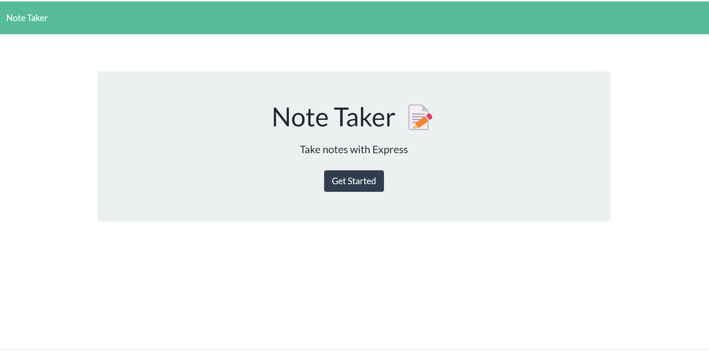

# Note Taker


## Description

This application will allow the users to write and save notes to keep track of tasks.
<br><br>

<br><br>
Click [HERE](https://aqueous-taiga-65079.herokuapp.com/) to view the deployed application on Heroku.
    
## Table of Contents
    
- [Description](#description)
- [Installation](#installation)
- [User Story](#usage)
- [Acceptance Criteria](#acceptance-criteria)
- [License](#license)
- [Contribution](#contribution)
- [Tests](#tests)
- [Questions](#questions)
    
## Installation
    
```
npm install

node server.js
```


## User Story
    
```
AS A small business owner
I WANT to be able to write and save notes
SO THAT I can organize my thoughts and keep track of tasks I need to complete
```
## Acceptance Criteria
```
GIVEN a note-taking application
WHEN I open the Note Taker
THEN I am presented with a landing page with a link to a notes page
WHEN I click on the link to the notes page
THEN I am presented with a page with existing notes listed in the left-hand column, plus empty fields to enter a new note title and the note’s text in the right-hand column
WHEN I enter a new note title and the note’s text
THEN a Save icon appears in the navigation at the top of the page
WHEN I click on the Save icon
THEN the new note I have entered is saved and appears in the left-hand column with the other existing notes
WHEN I click on an existing note in the list in the left-hand column
THEN that note appears in the right-hand column
WHEN I click on the Write icon in the navigation at the top of the page
THEN I am presented with empty fields to enter a new note title and the note’s text in the right-hand column

```
    
## License
    

    
## Contribution
    
N/A
    
## Tests
    
N/A
    
## Questions
    
If there are any questions or concerns, please contact me at:<br>
[GitHub](https://github.com/khanhpbui)<br>
[Email](mailto:pkkhanhbui@gmail.com)